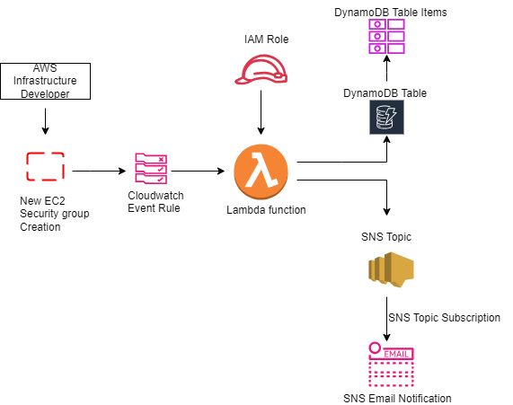

###### POC to Send Email Notifications When new EC2 Security Group getting created and save SG in DynamoDB Table.

This POC is to send Email Notifications when new EC2 Security Group created and save SG events in DynamoDB Table using Terraform.

## Pre-requisites

* Before Creating the configurations, need to enable new trail in AWS CloudTrail Console if it is not enabled already. Otherwise he cloudwatch events will not trigger and store.
* Create SNS and SNS topic subscription with email protocal. Verify the email confirmation subscription.
* Create IAM role with neccessary permissions to attach in lambda function.
* Create Lambda function(code implemented using python).
* Create DynamoDB table to save security group events.
* Create Cloudwatch Event and event trigger with event_pattern to trigger lambda whenever the new SG getting created.
* Once all the configurations has created, Need to create new Security Group. 

## Testing

* Created SNS and SNS topic subscription. verified the email.
* Created IAM Role with required permissions.
* Created Lambda function with python code which can send email notifications when new SG created using SNS.
* Created DynamoDB Table.
* Created Cloudwatch Event rule and Event target as lambda.
* Created new Security Group.
* Once the new SG created , Event rule is triggered the Lambda function and got email notification for the same. The events in SG will be store in DynamoDB Table Items.

## Architectural Diagram

